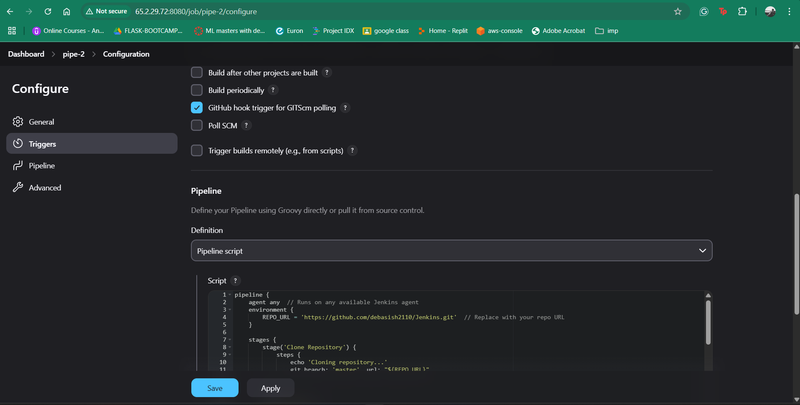
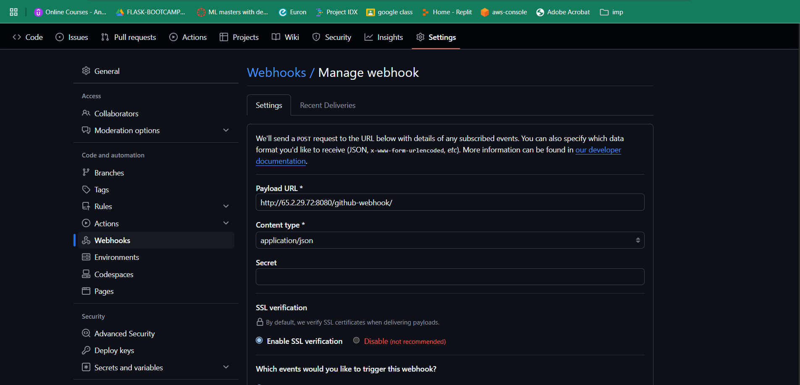
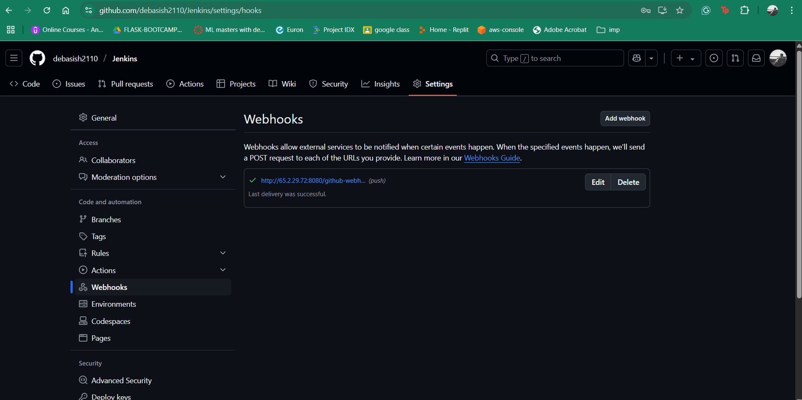
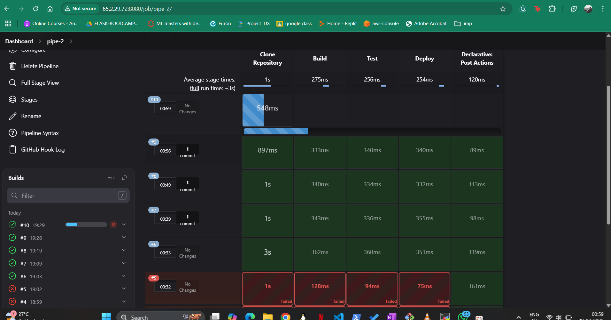
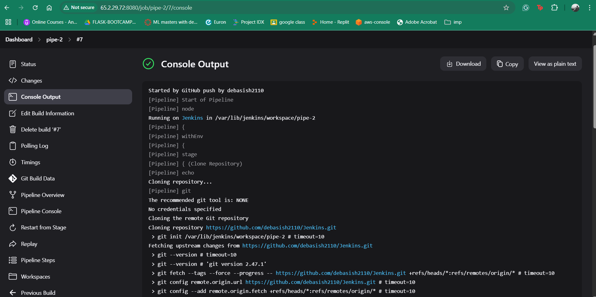

# Setting Up a GitHub Webhook for Jenkins

This guide explains how to set up a GitHub webhook for Jenkins to automatically trigger a pipeline whenever a push occurs in the repository.

## Prerequisites
- Jenkins installed and running.
- GitHub repository access.
- Jenkins URL accessible from GitHub (public or using **ngrok** if on a local machine).
- "GitHub Integration Plugin" installed in Jenkins.

## Step 1: Configure Jenkins Job
1. Open Jenkins and navigate to **Manage Jenkins → Manage Plugins**.
2. Install **GitHub Integration Plugin** if not already installed.
3. Create or open a **Pipeline Job** in Jenkins.
4. Go to **Configure** and do the following:
   - Under **Build Triggers**, check **GitHub hook trigger for GITScm polling**.
   - Save the configuration.

   


## Step 2: Generate Webhook URL
1. If Jenkins is publicly accessible, use your Jenkins URL:
   ```
   http://<jenkins-ip>:8080/github-webhook/
   ```
2. If Jenkins is running locally, expose it using ngrok:
   ```sh
   ngrok http 8080
   ```
   - Copy the generated `https://<ngrok-url>/github-webhook/`.

## Step 3: Create GitHub Webhook
1. Open your **GitHub repository**.
2. Go to **Settings → Webhooks**.
3. Click **Add webhook**.
4. In **Payload URL**, enter:
   ```
   http://<jenkins-ip>:8080/github-webhook/
   ```
   *(or the ngrok URL if using it)*.
5. Set **Content type** to `application/json`.
6. Choose **Just the push event**.
7. Click **Add Webhook**.

    
    

## Step 4: Test the Webhook
1. Make a small commit and push it:
   ```sh
   git commit --allow-empty -m "Trigger webhook test"
   git push origin main
   ```
2. Check Jenkins to see if the job runs automatically.
    **web hook: git push based triggered pipeline**
    
    **console log**
    

3. If the webhook does not trigger, check:
   - **GitHub Webhooks → Recent Deliveries** for errors.
   - **Jenkins logs** (`/var/log/jenkins/jenkins.log`).

## Troubleshooting
- Ensure Jenkins is publicly accessible.
- Verify the webhook URL ends with `/github-webhook/`.
- Ensure the **GitHub hook trigger** is enabled in Jenkins job settings.
- Restart Jenkins if necessary.

---
Now, your Jenkins pipeline should trigger automatically on every `git push`! 🚀
